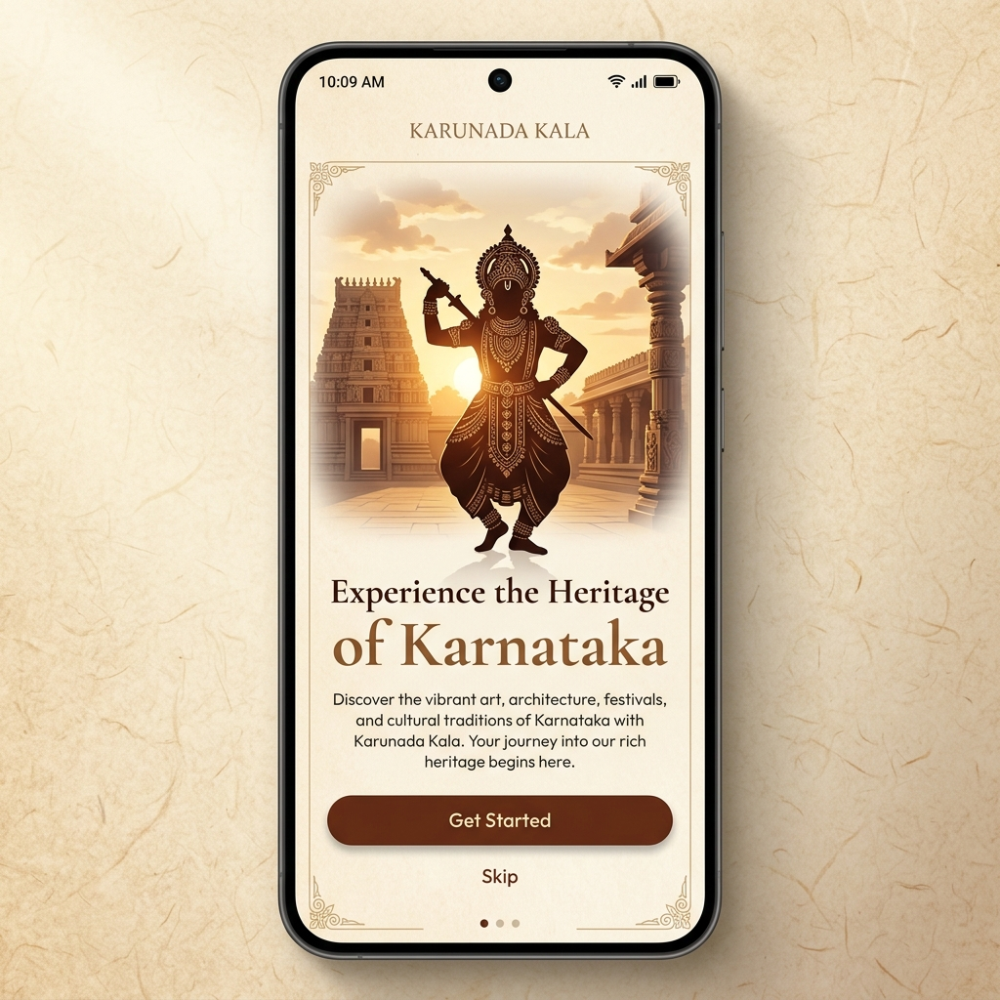
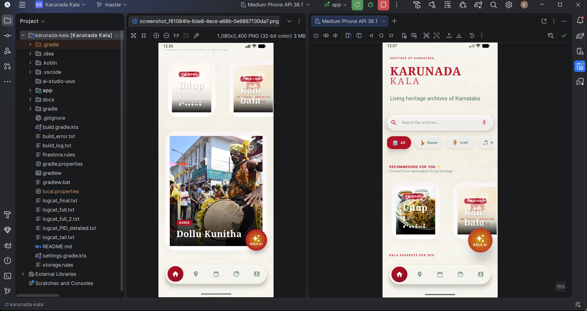
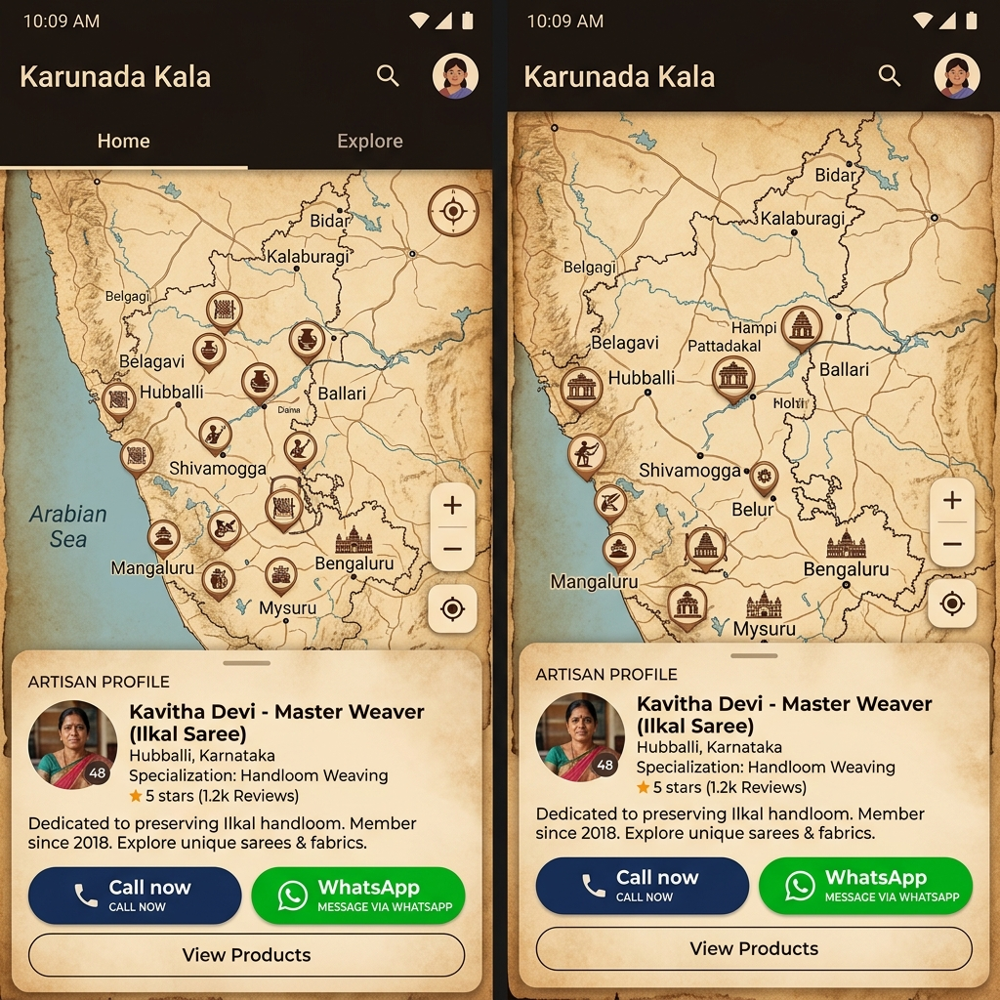
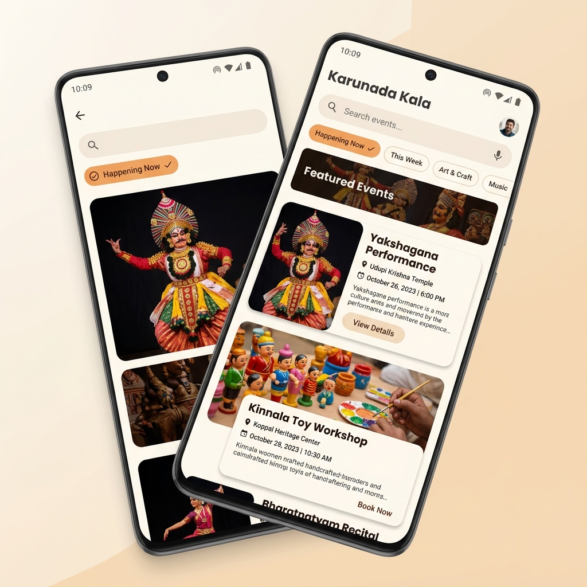
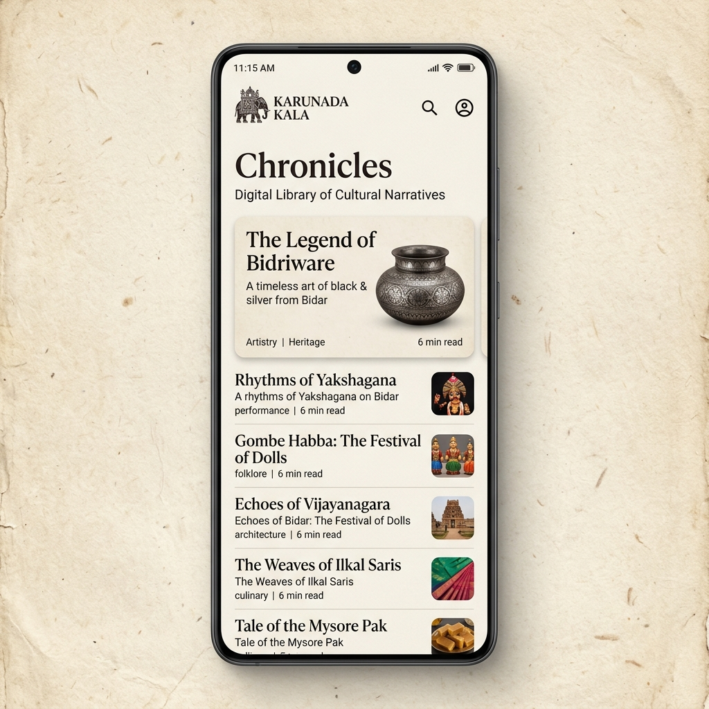
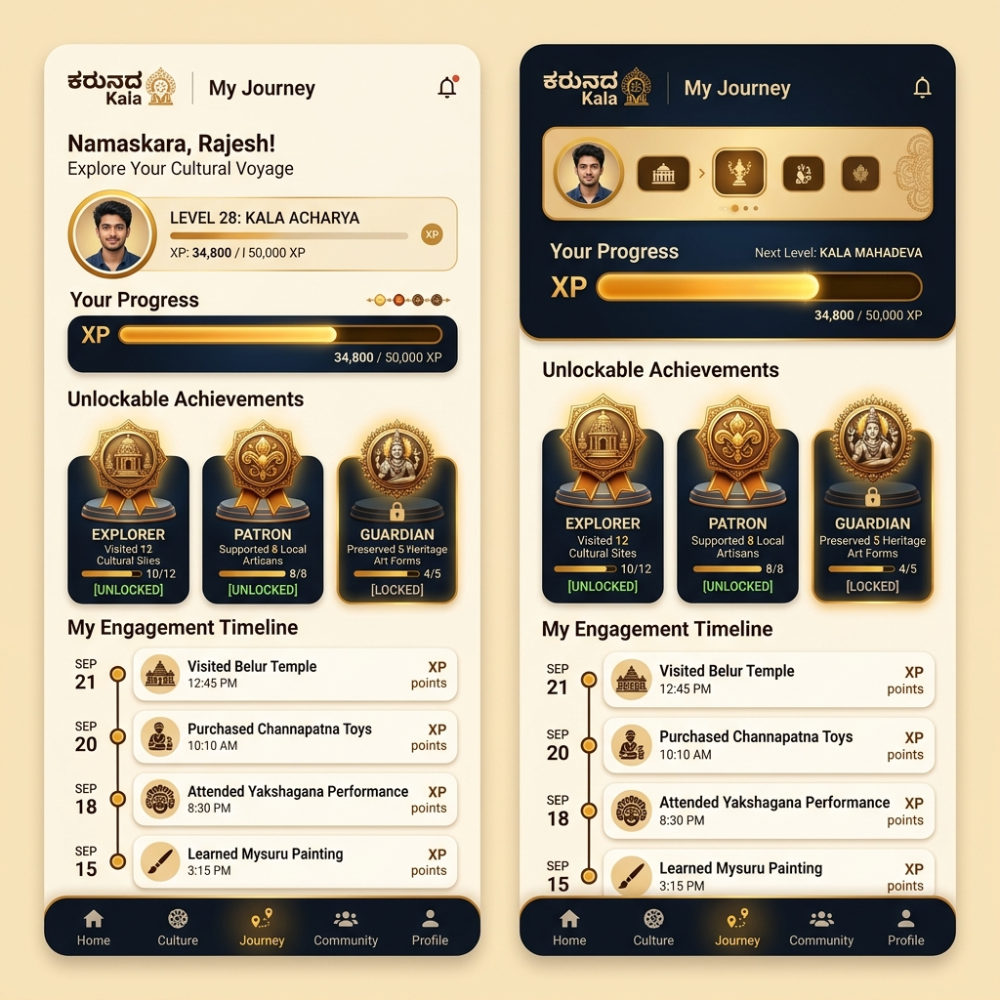

# Karunada Kala (ಕರ್ನಾಟಕದ ಕಲೆ) 🏺
### AI-Powered Cultural Ecosystem Platform

[](LICENSE)
[](https://developer.android.com/)
[](https://kotlinlang.org/)
[](https://developer.android.com/jetpack/compose)

**Karunada Kala** is a premium, AI-powered cultural discovery and preservation platform dedicated to the rich heritage of Karnataka. It serves as a "Living Cultural Journal," connecting modern audiences with traditional art forms, master artisans, and authentic heritage experiences.

---

## 📖 Overview
Developed as a tribute to Karnataka's living history, Karunada Kala bridges the gap between ancient traditions and modern technology. From the vibrant colors of **Yakshagana** to the intricate craftsmanship of **Bidriware**, the platform offers an immersive digital archive that celebrates the soul of Karunadu.

## ⚠️ Problem Statement
In a rapidly globalizing world, traditional art forms are losing visibility. Artisans struggle to find modern platforms to showcase their work, and the "Guru-Shishya" (Master-Disciple) tradition faces challenges in the digital age. Karunada Kala solves this by:
- Centralizing cultural knowledge in a high-fidelity digital format.
- Providing direct market and educational access to rural artisans.
- Gamifying heritage discovery to engage the younger generation.

## 🚀 Features
- **Art Form Explorer**: A curated catalog featuring parallax headers, cinematic transitions, and editorial typography.
- **Parchment Atlas (Maps)**: A custom-styled Google Maps interface (sepia tones, heritage markers) to locate artisan workshops and live events.
- **Guru-Shishya Enrollment**: A seamless registration flow for cultural workshops and apprenticeship programs.
- **Artisan Profiles**: High-fidelity profiles with "Tap to Call" and WhatsApp integration for direct artisan support.
- **Chronicles**: A specialized section for cultural narratives, folklore, and historical deep-dives.
- **My Journey**: A gamified dashboard tracking user engagement with unlockable badges like *Explorer*, *Patron*, and *Guardian*.

## 🛠 Technologies Used
- **Frontend**: Jetpack Compose (Material 3), Compose Destinations, Coil (Image Loading), Lottie (Animations).
- **Backend**: Firebase (Firestore, Auth, Storage, Analytics, Cloud Messaging).
- **AI Engine**: **Google Gemini 1.5 Pro** (Vertex AI / AI Studio) for heritage storytelling and interactive legends.
- **Maps**: Google Maps Compose SDK with custom JSON styling.
- **Architecture**: MVVM with Clean Architecture principles.
- **Local Storage**: Jetpack DataStore with a Cache-first strategy.

## 🏗 Architecture
The project is built on **MVVM (Model-View-ViewModel)** architecture, ensuring scalability and maintainability:
- **Data Layer**: Handles network requests (Firebase) and local caching (DataStore).
- **Domain Layer**: Contains business logic and Use Cases for AI generation and data filtering.
- **UI Layer**: A declarative, reactive UI system built with Jetpack Compose for a premium "editorial" feel.

## 📸 Screenshots
<table align="center">
  <tr>
    <td align="center"><b>Onboarding</b><br></td>
    <td align="center"><b>Explore</b><br></td>
    <td align="center"><b>Map</b><br></td>
  </tr>
  <tr>
    <td align="center"><b>Events</b><br></td>
    <td align="center"><b>Chronicles</b><br></td>
    <td align="center"><b>Journey</b><br></td>
  </tr>
</table>

## 📦 APK Download
Get the latest version of the app to explore Karnataka's heritage:
🚀 **[Download Karunada-Kala-v1.apk](apk/Karunada-Kala-v1.apk)**

## ⚙️ Installation Steps
1. **Clone the Repo**:
   ```bash
   git clone https://github.com/AiEshaan/karunada-kala.git
   ```
2. **Open in Android Studio**: Import the project and allow Gradle to sync.
3. **Configure API Keys**:
   - Open `local.properties`.
   - Add `MAPS_API_KEY=your_key_here`.
   - Add `GEMINI_API_KEY=your_key_here`.
4. **Build & Run**: Deploy to a physical device or emulator (API 24+).

## 🔥 Firebase Integration
- **Firestore**: Real-time sync for art forms, events, and artisan data.
- **Authentication**: Secure guest and artisan login flows.
- **Storage**: Hosting high-resolution media and artisan gallery images.

## 🧠 AI Features (Powered by Gemini)
- **Kala AI Assistant**: A specialized cultural chatbot that answers complex heritage queries.
- **3D Legend Flip**: Tap an Art Card to flip it and reveal a Gemini-generated personalized legend about that specific art form.
- **Narrative Synthesis**: AI-driven synthesis of historical data into engaging, accessible narratives.

## 🌟 Future Enhancements
- **AR Heritage**: Augmented Reality previews of traditional artifacts (e.g., Kinnala Toys) in 3D.
- **Marketplace**: A direct "Artisan-to-Consumer" e-commerce platform for authentic crafts.
- **Audio Guides**: AI-generated multi-lingual audio tours for artisan workshops.

## 👨‍💻 Internship Details
- **Project**: Karunada Kala – AI-Powered Cultural Ecosystem
- **Context**: Final Internship Submission (May 2026)
- **Objective**: Demonstrating high-fidelity Android development, AI integration, and real-time systems.
- **Documents**: [PRD Document](docs/Karunada_Kala_PRD.pdf)

## 👨‍💻 Developed By
**Eshaan Praajakt Mayekar**  
*Built with ❤️ for the Heritage of Karnataka.*

---

### 🏆 GitHub Repository Details
**Description**: AI-powered Android cultural ecosystem platform for preserving Karnataka heritage using Firebase, Gemini AI, and Google Maps.  
**Topics**: `android`, `kotlin`, `firebase`, `jetpack-compose`, `gemini-ai`, `google-maps`, `mvvm`, `android-app`, `cultural-platform`
